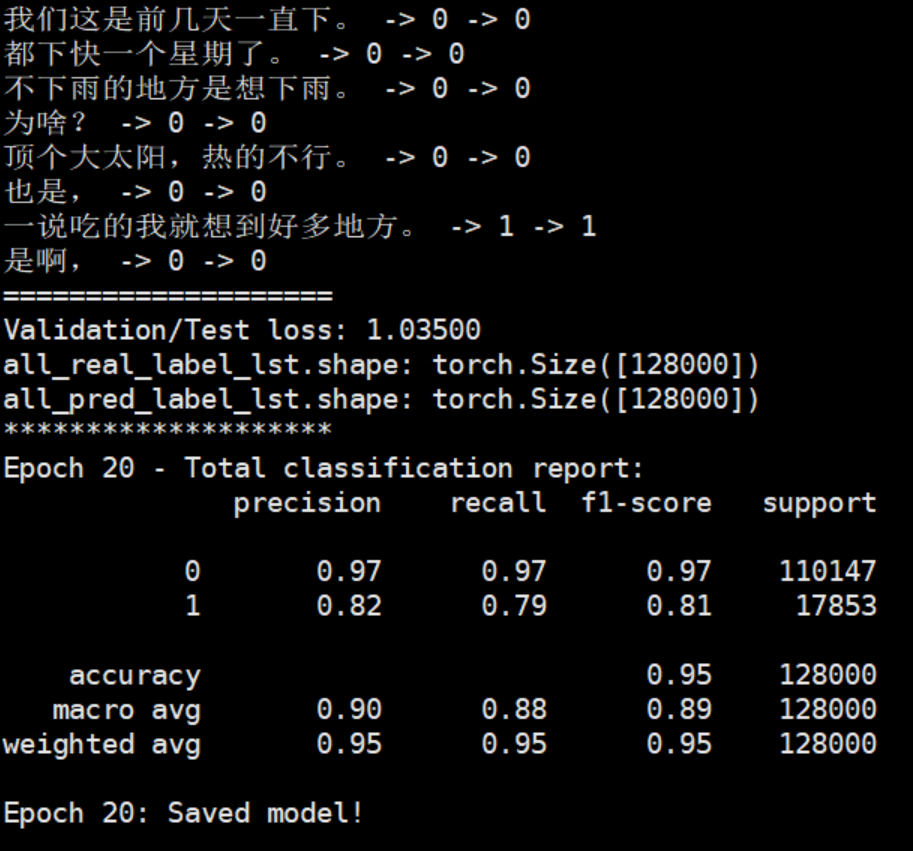

# Topic_Seg_BERT_TCN
This repository contains the code and data for our paper *Topic Segmentation for Dialogue Stream*.

daT_train.txt: DA训练集,一行为一个样例，标签和数据以+++$+++分隔,1表示对应的utterance为topic边界,0表示无变换。

daT_test.txt: DA测试集,格式同上。

daT_val.txt: DA验证集，格式同上。

TCN/poly/mdata/daT_train_data.pkl: DA训练集经BERT编码后的文件

TCN/poly/mdata/daT_test_data.pkl: DA测试集经BERT编码后的文件

TCN/poly/mdata/daT_dev_data.pkl: DA验证集经BERT编码后的文件

TCN/poly/mdata/daT_train_labels.pkl: DA训练集的标签文件

TCN/poly/mdata/daT_test_data.pkl: DA测试集的标签文件

TCN/poly/mdata/daT_dev_data.pkl: DA验证集的标签文件

daT_run.py: 主程序

daT_record.log: 运行记录

daT_record.log.bak: 日志记录备份

model_daT.pt: 训练后保存的模型参数

**Usage**:
1. 使用BERT(bert as service)将原txt中的文本部分进行编码，编码后的文件存到TCN/poly/mdata下，修改utils.py中对应部分进行数据加载
2. 运行主程序 $python daT_run.py
3. 训练记录及测试结果保存在daT_record.log中

**Result**

