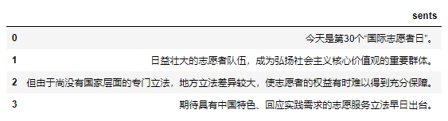
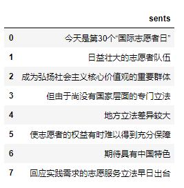
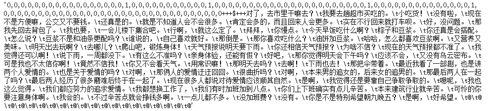
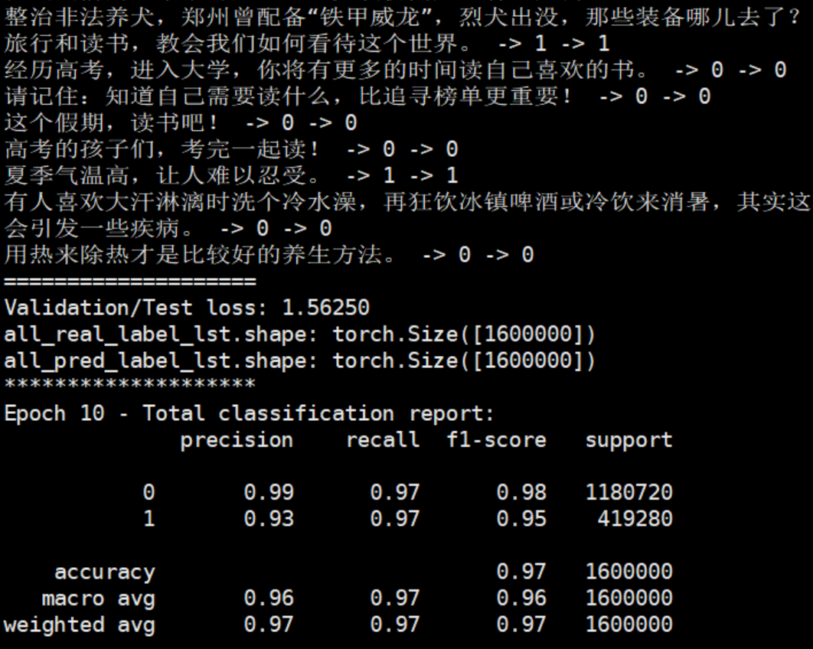
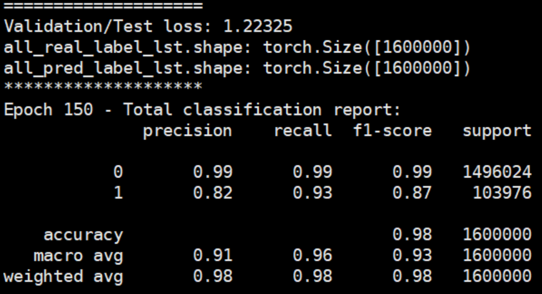
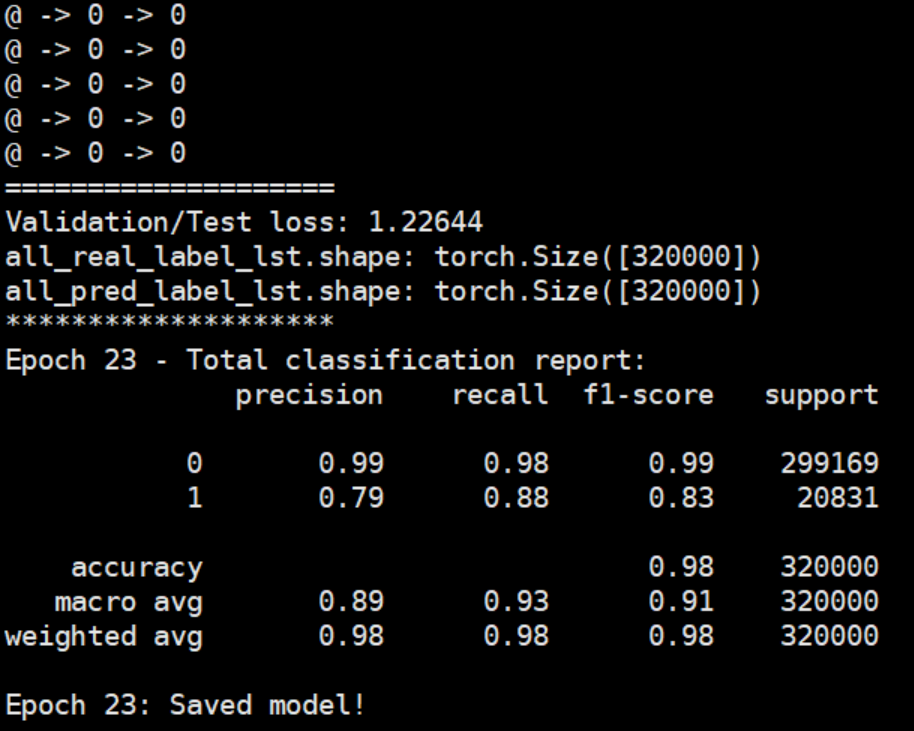

# Topic_Seg_BERT_TCN
This repository contains the code and data for our paper *Topic Segmentation for Dialogue Stream*.

### 1. Dependencies

1) Embedding part: Han Xiao's [bert-as-service](https://github.com/hanxiao/bert-as-service)

2) Topic switch detection part: Shaojie Bai's [Temporal Convolutional Network](https://github.com/locuslab/TCN)

### 2. Datasets

1) Weibo

Weibo dataset is composed of short news collected from the Internet, it provides two types of text stream: weibo-long and weibo-short.

weibo-long: each Weibo news is divided into complete sentences, i.e.



weibo-short: each Weibo news is divided into short setences by commas, i.e.



2) DAct

DAct is composed of dialogue utterances with two speakers.

Data Format: one instance per line, the labels and sentences are separated by the ++$+++ symbol. Label 1 / 0 means a / no topic switch point in corresponding utterances respectively. Symbol '@' is used as the place holder to keep a fixed-size window, which empirically may improve the performance of the model.




### 3. Usage

1) Start the bert-as-service server:

```bert-serving-start -model_dir /tmp/chinese_L-12_H-768_A-12/ -num_worker=16```

2) Run the main.py script:

```$python main.py --taskname weibo-long --window_sz 100```

3) The training and testing results are logged in the file {taskname}_record.log.


**Some experiments' results**



Exp screenshot for Weibo-long dataset </div>


-----



<center>Exp screenshot for Weibo-short dataset</center><br>

--------



<center> Exp screenshot for DAct dataset</center><br>


